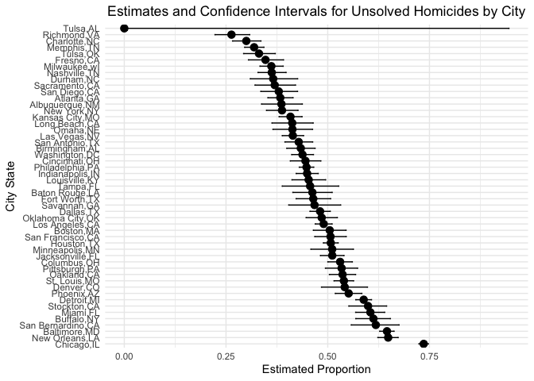
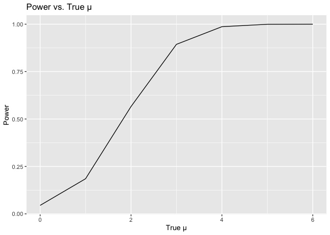
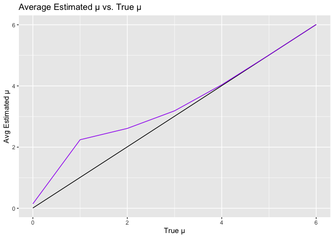

p8105_hw5_bac2214
================
Brianna Carnagie
2023-11-12

### Question 1

In this code chunk, I read in the csv file and used the `prop.test`
function to calculate the estimated proportion and CI’s for Baltimore,
MD.

``` r
homicide_df = read_csv("data/homicide-data.csv") |> 
  mutate(
    city_state = paste(city, state, sep = ",")
    )
```

    ## Rows: 52179 Columns: 12
    ## ── Column specification ────────────────────────────────────────────────────────
    ## Delimiter: ","
    ## chr (9): uid, victim_last, victim_first, victim_race, victim_age, victim_sex...
    ## dbl (3): reported_date, lat, lon
    ## 
    ## ℹ Use `spec()` to retrieve the full column specification for this data.
    ## ℹ Specify the column types or set `show_col_types = FALSE` to quiet this message.

``` r
homicides_by_city = read_csv("data/homicide-data.csv") |> 
  mutate(
    city_state = paste(city, state, sep = ",")) |> 
  group_by(city_state) |> 
  summarize(total_homicides = n(),
            unsolved_homicides = sum(disposition %in% c("Closed without arrest", "Open/No arrest")))
```

    ## Rows: 52179 Columns: 12
    ## ── Column specification ────────────────────────────────────────────────────────
    ## Delimiter: ","
    ## chr (9): uid, victim_last, victim_first, victim_race, victim_age, victim_sex...
    ## dbl (3): reported_date, lat, lon
    ## 
    ## ℹ Use `spec()` to retrieve the full column specification for this data.
    ## ℹ Specify the column types or set `show_col_types = FALSE` to quiet this message.

``` r
baltimore_data = homicides_by_city |> 
  filter(city_state == "Baltimore,MD") 
  
baltimore_prop_test = 
  prop.test(x = baltimore_data$unsolved_homicides,
            n = baltimore_data$total_homicides) |> 
  broom::tidy() |> 
  mutate(
    est_prop = estimate[1],
    conf_int = paste(conf.low, conf.high, sep = ",")) |> 
  select(est_prop,conf_int)
```

After observing the raw dataset, I noticed that it contains details
about the victim of a homicide including their name, race, age, and sex.
There are also details regarding the location down to the latitude and
longitude as well as the disposition of the person who committed the
homicide.

I am now repeating the steps for each city and state value in the
homicides_by_city dataframe using a function and the purrr package.

``` r
df_to_list = split(homicides_by_city, seq(nrow(homicides_by_city)))

prop_and_ci = function(data) {
  result = prop.test(x = data$unsolved_homicides, n = data$total_homicides)
  tidy_result = tidy(result)
  estimated_proportion = tidy_result$estimate[1]
  conf_low = tidy_result$conf.low
  conf_high = tidy_result$conf.high
  return(data.frame(estimated_proportion, conf_low, conf_high))
}

output = map(df_to_list, prop_and_ci) |> 
  bind_rows() |> 
  mutate(city_state = unique(homicides_by_city$city_state)) |> 
  select(city_state,estimated_proportion:conf_high)
```

    ## Warning in prop.test(x = data$unsolved_homicides, n = data$total_homicides):
    ## Chi-squared approximation may be incorrect

Here is the plot of estimates and confidence intervals for unsolved
homicides by city.

``` r
ggplot(output, aes(x = reorder(city_state, -estimated_proportion), y = estimated_proportion)) +
  geom_point(size = 3) +
  geom_errorbar(aes(ymin = conf_low, ymax = conf_high), width = 0.2) +
  coord_flip() +  # Flip the x and y axes for horizontal bars
  labs(x = "City State", y = "Estimated Proportion") +
  theme_minimal() +  # Apply a minimal theme
  ggtitle("Estimates and Confidence Intervals for Unsolved Homicides by City") +
  theme(plot.title = element_text(hjust = 0.5))  # Center the title
```

<!-- -->

The plot shows that Tulsa has the lowest proportion of unsolved
homicides while Chicago has the highest proportion of unsolved
homicides.

### Question 2

``` r
file_names = list.files(path = "data/question 2", pattern = ".csv", full.names = TRUE)

tidy_study_data = lapply(file_names, function(file) {
  
  df = read_csv(file)  
  subject_id = str_extract(basename(file), "(con|exp)_\\d+")
  arm = ifelse(grepl("con_", basename(file)), "control", "experimental")
  
  df = df |> 
    pivot_longer(cols = c(week_1, week_2, week_3, week_4, week_5, week_6, week_7, week_8), 
                 names_to = "week", values_to = "observation") |> 
    mutate(
      subject = subject_id,
      arm = arm,
      week = as.numeric(gsub("week_", "", week))
    )
  return(df)
  
}) |> bind_rows() |> select(week, arm, subject, observation)
```

    ## Rows: 1 Columns: 8
    ## ── Column specification ────────────────────────────────────────────────────────
    ## Delimiter: ","
    ## dbl (8): week_1, week_2, week_3, week_4, week_5, week_6, week_7, week_8
    ## 
    ## ℹ Use `spec()` to retrieve the full column specification for this data.
    ## ℹ Specify the column types or set `show_col_types = FALSE` to quiet this message.
    ## Rows: 1 Columns: 8
    ## ── Column specification ────────────────────────────────────────────────────────
    ## Delimiter: ","
    ## dbl (8): week_1, week_2, week_3, week_4, week_5, week_6, week_7, week_8
    ## 
    ## ℹ Use `spec()` to retrieve the full column specification for this data.
    ## ℹ Specify the column types or set `show_col_types = FALSE` to quiet this message.
    ## Rows: 1 Columns: 8
    ## ── Column specification ────────────────────────────────────────────────────────
    ## Delimiter: ","
    ## dbl (8): week_1, week_2, week_3, week_4, week_5, week_6, week_7, week_8
    ## 
    ## ℹ Use `spec()` to retrieve the full column specification for this data.
    ## ℹ Specify the column types or set `show_col_types = FALSE` to quiet this message.
    ## Rows: 1 Columns: 8
    ## ── Column specification ────────────────────────────────────────────────────────
    ## Delimiter: ","
    ## dbl (8): week_1, week_2, week_3, week_4, week_5, week_6, week_7, week_8
    ## 
    ## ℹ Use `spec()` to retrieve the full column specification for this data.
    ## ℹ Specify the column types or set `show_col_types = FALSE` to quiet this message.
    ## Rows: 1 Columns: 8
    ## ── Column specification ────────────────────────────────────────────────────────
    ## Delimiter: ","
    ## dbl (8): week_1, week_2, week_3, week_4, week_5, week_6, week_7, week_8
    ## 
    ## ℹ Use `spec()` to retrieve the full column specification for this data.
    ## ℹ Specify the column types or set `show_col_types = FALSE` to quiet this message.
    ## Rows: 1 Columns: 8
    ## ── Column specification ────────────────────────────────────────────────────────
    ## Delimiter: ","
    ## dbl (8): week_1, week_2, week_3, week_4, week_5, week_6, week_7, week_8
    ## 
    ## ℹ Use `spec()` to retrieve the full column specification for this data.
    ## ℹ Specify the column types or set `show_col_types = FALSE` to quiet this message.
    ## Rows: 1 Columns: 8
    ## ── Column specification ────────────────────────────────────────────────────────
    ## Delimiter: ","
    ## dbl (8): week_1, week_2, week_3, week_4, week_5, week_6, week_7, week_8
    ## 
    ## ℹ Use `spec()` to retrieve the full column specification for this data.
    ## ℹ Specify the column types or set `show_col_types = FALSE` to quiet this message.
    ## Rows: 1 Columns: 8
    ## ── Column specification ────────────────────────────────────────────────────────
    ## Delimiter: ","
    ## dbl (8): week_1, week_2, week_3, week_4, week_5, week_6, week_7, week_8
    ## 
    ## ℹ Use `spec()` to retrieve the full column specification for this data.
    ## ℹ Specify the column types or set `show_col_types = FALSE` to quiet this message.
    ## Rows: 1 Columns: 8
    ## ── Column specification ────────────────────────────────────────────────────────
    ## Delimiter: ","
    ## dbl (8): week_1, week_2, week_3, week_4, week_5, week_6, week_7, week_8
    ## 
    ## ℹ Use `spec()` to retrieve the full column specification for this data.
    ## ℹ Specify the column types or set `show_col_types = FALSE` to quiet this message.
    ## Rows: 1 Columns: 8
    ## ── Column specification ────────────────────────────────────────────────────────
    ## Delimiter: ","
    ## dbl (8): week_1, week_2, week_3, week_4, week_5, week_6, week_7, week_8
    ## 
    ## ℹ Use `spec()` to retrieve the full column specification for this data.
    ## ℹ Specify the column types or set `show_col_types = FALSE` to quiet this message.
    ## Rows: 1 Columns: 8
    ## ── Column specification ────────────────────────────────────────────────────────
    ## Delimiter: ","
    ## dbl (8): week_1, week_2, week_3, week_4, week_5, week_6, week_7, week_8
    ## 
    ## ℹ Use `spec()` to retrieve the full column specification for this data.
    ## ℹ Specify the column types or set `show_col_types = FALSE` to quiet this message.
    ## Rows: 1 Columns: 8
    ## ── Column specification ────────────────────────────────────────────────────────
    ## Delimiter: ","
    ## dbl (8): week_1, week_2, week_3, week_4, week_5, week_6, week_7, week_8
    ## 
    ## ℹ Use `spec()` to retrieve the full column specification for this data.
    ## ℹ Specify the column types or set `show_col_types = FALSE` to quiet this message.
    ## Rows: 1 Columns: 8
    ## ── Column specification ────────────────────────────────────────────────────────
    ## Delimiter: ","
    ## dbl (8): week_1, week_2, week_3, week_4, week_5, week_6, week_7, week_8
    ## 
    ## ℹ Use `spec()` to retrieve the full column specification for this data.
    ## ℹ Specify the column types or set `show_col_types = FALSE` to quiet this message.
    ## Rows: 1 Columns: 8
    ## ── Column specification ────────────────────────────────────────────────────────
    ## Delimiter: ","
    ## dbl (8): week_1, week_2, week_3, week_4, week_5, week_6, week_7, week_8
    ## 
    ## ℹ Use `spec()` to retrieve the full column specification for this data.
    ## ℹ Specify the column types or set `show_col_types = FALSE` to quiet this message.
    ## Rows: 1 Columns: 8
    ## ── Column specification ────────────────────────────────────────────────────────
    ## Delimiter: ","
    ## dbl (8): week_1, week_2, week_3, week_4, week_5, week_6, week_7, week_8
    ## 
    ## ℹ Use `spec()` to retrieve the full column specification for this data.
    ## ℹ Specify the column types or set `show_col_types = FALSE` to quiet this message.
    ## Rows: 1 Columns: 8
    ## ── Column specification ────────────────────────────────────────────────────────
    ## Delimiter: ","
    ## dbl (8): week_1, week_2, week_3, week_4, week_5, week_6, week_7, week_8
    ## 
    ## ℹ Use `spec()` to retrieve the full column specification for this data.
    ## ℹ Specify the column types or set `show_col_types = FALSE` to quiet this message.
    ## Rows: 1 Columns: 8
    ## ── Column specification ────────────────────────────────────────────────────────
    ## Delimiter: ","
    ## dbl (8): week_1, week_2, week_3, week_4, week_5, week_6, week_7, week_8
    ## 
    ## ℹ Use `spec()` to retrieve the full column specification for this data.
    ## ℹ Specify the column types or set `show_col_types = FALSE` to quiet this message.
    ## Rows: 1 Columns: 8
    ## ── Column specification ────────────────────────────────────────────────────────
    ## Delimiter: ","
    ## dbl (8): week_1, week_2, week_3, week_4, week_5, week_6, week_7, week_8
    ## 
    ## ℹ Use `spec()` to retrieve the full column specification for this data.
    ## ℹ Specify the column types or set `show_col_types = FALSE` to quiet this message.
    ## Rows: 1 Columns: 8
    ## ── Column specification ────────────────────────────────────────────────────────
    ## Delimiter: ","
    ## dbl (8): week_1, week_2, week_3, week_4, week_5, week_6, week_7, week_8
    ## 
    ## ℹ Use `spec()` to retrieve the full column specification for this data.
    ## ℹ Specify the column types or set `show_col_types = FALSE` to quiet this message.
    ## Rows: 1 Columns: 8
    ## ── Column specification ────────────────────────────────────────────────────────
    ## Delimiter: ","
    ## dbl (8): week_1, week_2, week_3, week_4, week_5, week_6, week_7, week_8
    ## 
    ## ℹ Use `spec()` to retrieve the full column specification for this data.
    ## ℹ Specify the column types or set `show_col_types = FALSE` to quiet this message.

``` r
study_data_plot = ggplot(tidy_study_data, aes(x = week, y = observation, group = subject, color = arm)) +
  geom_line() +
  labs(x = "Week", y = "Observation") +
  ggtitle("Study Observations by Week") 
```

The observations for the experimental group tend to be higher over the
weeks compared to the control group. However, there is a considerable
variation within both groups, and some subjects in the control group
have observations that overlap with those in the experimental group.

### Question 3

``` r
# Set design elements
n <- 30
sigma <- 5
alpha <- 0.05
true_mu_values <- c(0, 1, 2, 3, 4, 5, 6)
num_simulations <- 5000

# Initialize data frames to store results
results_df <- data.frame(
  True_mu = numeric(num_simulations),
  Estimated_mu = numeric(num_simulations),
  Null_Rejected = logical(num_simulations)
)

# Set the number of CPU cores to use for parallel processing
num_cores <- detectCores()

# Create a cluster for parallel processing
cl <- makeCluster(num_cores)

# Export required packages to the parallel workers
clusterEvalQ(cl, {
  library(dplyr)
  library(broom)
})
```

    ## [[1]]
    ## [1] "broom"     "dplyr"     "stats"     "graphics"  "grDevices" "utils"    
    ## [7] "datasets"  "methods"   "base"     
    ## 
    ## [[2]]
    ## [1] "broom"     "dplyr"     "stats"     "graphics"  "grDevices" "utils"    
    ## [7] "datasets"  "methods"   "base"     
    ## 
    ## [[3]]
    ## [1] "broom"     "dplyr"     "stats"     "graphics"  "grDevices" "utils"    
    ## [7] "datasets"  "methods"   "base"     
    ## 
    ## [[4]]
    ## [1] "broom"     "dplyr"     "stats"     "graphics"  "grDevices" "utils"    
    ## [7] "datasets"  "methods"   "base"

``` r
# Parallelize the simulation
clusterExport(cl, c("n", "sigma", "alpha", "true_mu_values", "num_simulations"))
results_list <- parLapply(cl, true_mu_values, function(true_mu) {
  set.seed(123)  # For reproducibility
  results <- data.frame(
    True_mu = numeric(num_simulations),
    Estimated_mu = numeric(num_simulations),
    Null_Rejected = logical(num_simulations)
  )
  for (i in 1:num_simulations) {
    data <- rnorm(n, mean = true_mu, sd = sigma)
    t_test_result <- t.test(data, mu = 0, alternative = "two.sided")
    results[i, "True_mu"] <- true_mu
    results[i, "Estimated_mu"] <- tidy(t_test_result)$estimate[1]
    results[i, "Null_Rejected"] <- t_test_result$p.value < alpha
  }
  return(results)
})

# Combine results from parallel processing
results_df <- do.call(rbind, results_list)

# Calculate power and average estimates
power_df <- results_df %>%
  group_by(True_mu) %>%
  summarize(
    Power = mean(Null_Rejected),
    Avg_Estimated_mu = mean(Estimated_mu),
    Avg_Estimated_mu_Rejected = mean(Estimated_mu[Null_Rejected])
  )


ggplot(power_df, aes(x = True_mu, y = Power)) +
  geom_line() +
  labs(x = "True μ", y = "Power") +
  ggtitle("Power vs. True μ")
```

<!-- -->

The graph has a positive correlation between true mu and power,
indicating that as the true mean deviates from the null hypothesis value
(0 in this case), the power of the test increases. This means that for
larger effect sizes, the test is more likely to correctly reject the
null hypothesis. However, once the true mu approaches 4, the power
standardizes and no longer increases as it is extremely close to 1.

``` r
ggplot(power_df, aes(x = True_mu, y = Avg_Estimated_mu)) +
  geom_line() +
  labs(x = "True μ", y = "Avg Estimated μ") +
  ggtitle("Average Estimated μ vs. True μ") +
  geom_line(data = power_df[power_df$Power > 0, ], aes(x = True_mu, y = Avg_Estimated_mu_Rejected), color = "purple")
```

<!-- -->

The sample average of μ̂ (the average we get from our tests) when we
reject the null hypothesis is not always equal to the true value of μ
(the real average we’re trying to measure). This is because when we do
lots of tests, sometimes we get a higher average just by chance. And
when that happens, we’re more likely to see a difference that is not
zero and reject the null hypothesis.

So, the times when we reject the null hypothesis might include some of
these chance results. Because these chance results tend to be higher
than the true average, when we look at the average of μ̂ from these
tests, it’s an overestimate. This is why the average of μ̂ from the tests
where we reject the null isn’t quite the same as the true average μ;
it’s an exaggerated version of the truth.
