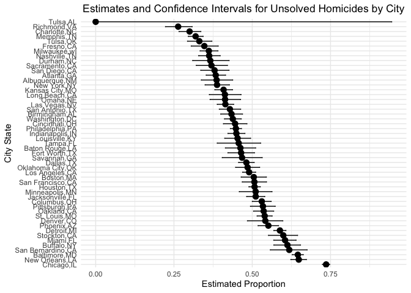

p8105_hw5_bac2214
================
Brianna Carnagie
2023-11-12

### Question 1

The raw data contains details about the victim of a homicide including
their name, race, age, and sex. There are also details regarding the
location down to the latitude and longitude as well as the disposition
of the person who committed the homicide.

I am now repeating the steps for each city and state value in the
homicides_by_city dataframe.

``` r
df_to_list = split(homicides_by_city, seq(nrow(homicides_by_city)))

prop_and_ci = function(data) {
  result = prop.test(x = data$unsolved_homicides, n = data$total_homicides)
  tidy_result = tidy(result)
  estimated_proportion = tidy_result$estimate[1]
  conf_low = tidy_result$conf.low
  conf_high = tidy_result$conf.high
  return(data.frame(estimated_proportion, conf_low, conf_high))
}

output = map(df_to_list, prop_and_ci) |> 
  bind_rows() |> 
  mutate(city_state = unique(homicides_by_city$city_state)) |> 
  select(city_state,estimated_proportion:conf_high)
```

    ## Warning in prop.test(x = data$unsolved_homicides, n = data$total_homicides):
    ## Chi-squared approximation may be incorrect

Here is the plot of estimates and confidence intervals for unsolved
homicides by city.

``` r
ggplot(output, aes(x = reorder(city_state, -estimated_proportion), y = estimated_proportion)) +
  geom_point(size = 3) +
  geom_errorbar(aes(ymin = conf_low, ymax = conf_high), width = 0.2) +
  coord_flip() +  # Flip the x and y axes for horizontal bars
  labs(x = "City State", y = "Estimated Proportion") +
  theme_minimal() +  # Apply a minimal theme
  ggtitle("Estimates and Confidence Intervals for Unsolved Homicides by City") +
  theme(plot.title = element_text(hjust = 0.5))  # Center the title
```

<!-- -->

The plot shows that Tulsa has the lowest proportion of unsolved
homicides while Chicago has the highest proportion of unsolved
homicides.
